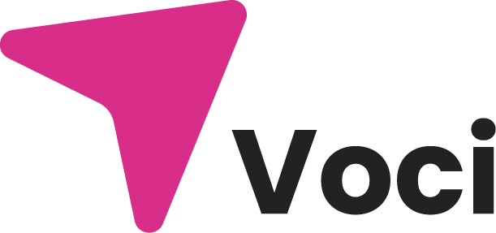

# Voci
<a id="readme-top"></a>
"Voices":  In the European media landscape, the presence of female voices is still limited.

<!-- PROJECT LOGO -->
<div>
   
</div>

<!-- TABLE OF CONTENTS -->
<details>
  <summary top="10px">Table of Contents</summary>
   <ol>
      <li>
         <a href="#description">Description</a>
      </li>
      <li>
         <a href="#project">About The Project</a>
      </li>
      <li>
         <a href="#getting-started">Get Started</a>
      </li>
      <li>
         <a href="#link-Online-in-description">Link Online</a>
      </li>
   </ol>
</details>

> ## **Description**

• "Voci"... In the European media landscape, the presence of female voices is still limited. 
The founders of Voci decided to fill this gap, creating a space that would give visibility to women's stories and ideas, breaking the silence that too often surrounds them.

...Contribute to the achievement of gender equality, promoting a more equitable and inclusive narrative.

> ## **Project**

> [!NOTE]
> created with:

- [x] HTML
- [x] TypeScript

<!-- GETTING STARTED -->
> ## **Getting started**

1. Clone the repo:
   ```sh
   git clone https://github.com/AleShini92/Voci.git
   ```
2. Typescript in console:
   ```sh
   tsc -w
   ```
<p align="right">(<a href="#readme-top">back to top</a>)</p>

<!-- LINK IN DESCRIPTION -->
> #### **Link Online in description**

`</>` [Link CodePen](https://codepen.io/AleShini92/pen/emmYxeZ) <--- Click Here to visit the page online.
<p align="right">(<a href="#readme-top">back to top</a>)</p>
